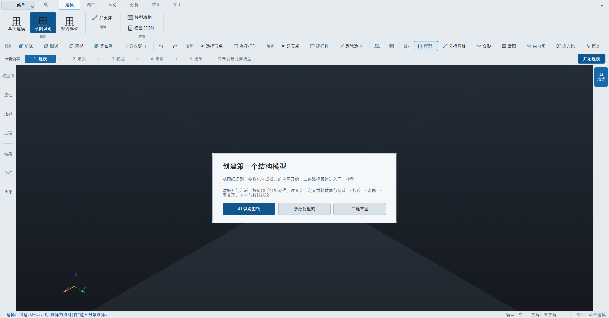
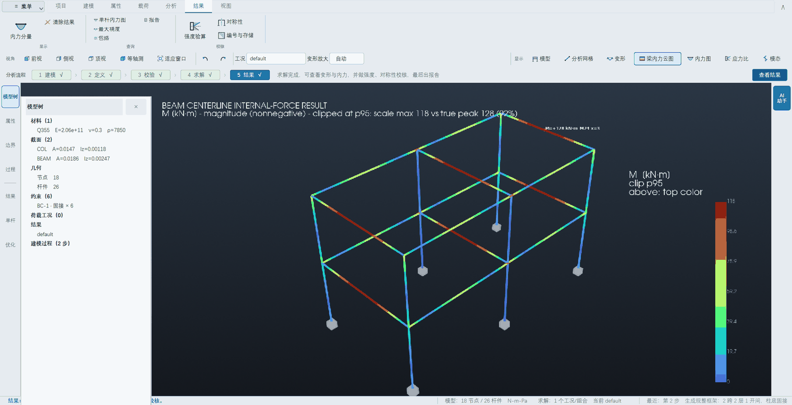
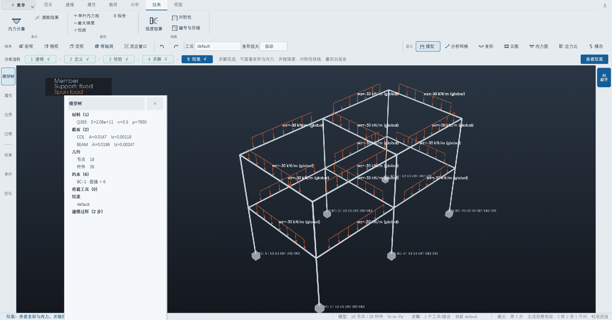
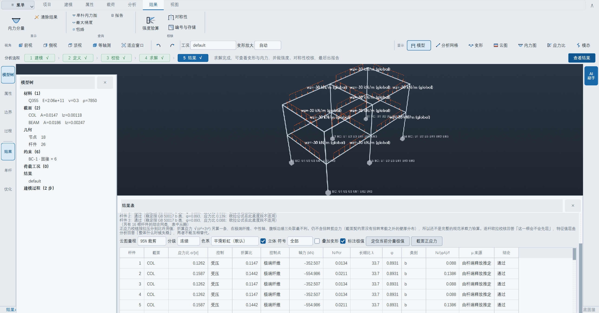
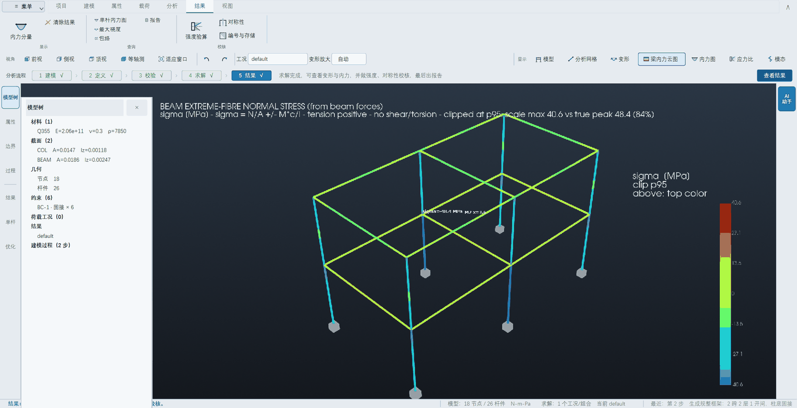

# 使用手册

**这本手册不假设你学过结构力学，也不假设你会写程序。**
从"这软件是干什么的"开始，每一步都写清楚**点哪里、会看到什么、下一步做什么**。

如果你只想尽快看到东西动起来，直接翻到 **第 2 章 五分钟上手**。

> 学过材料力学、结构力学的话，读 **《大学生教程》（`docs/大学生教程.md`）**
> 更合适：那本讲得深一层——每个功能背后在算什么、什么时候该用、
> 什么时候它会拒绝你，还有完整的能力边界和快捷键表。

---

## 1 这个软件是干什么的

想象你用积木搭一个架子：几根竖着的柱子，上面横着几根梁。搭好之后你想知道：

- 站上去会不会塌？
- 哪根最吃力？
- 会弯到什么程度？

这个软件就是回答这三个问题的。你告诉它**架子长什么样**、**哪里被固定住**、
**上面压了多重**，它算出**每根杆受多大力、弯了多少**，并且告诉你**够不够结实**。

它还有一个别的软件没有的地方：**你可以直接用中文跟它说话。**
比如打一句"两跨三层，跨度 6 米，层高 3.6 米，梁上均布 20 kN/m"，
它自己就把架子搭好、荷载加好、算好。

### 几个词，用生活语言解释

| 专业词 | 就是指 | 在软件里长什么样 |
|---|---|---|
| **节点** | 杆子和杆子接头的地方 | 一个小点 |
| **杆件** | 一根柱子或一根梁 | 一根管子 |
| **约束（支座）** | 被钉死、不能动的地方 | 柱脚下面的小方块或三角 |
| **荷载** | 压在上面的重量 | 一排绿色小箭头 |
| **工况** | 一种受力情况 | 比如"自重"是一种，"刮风"是另一种 |
| **内力** | 杆子内部承受的力 | 云图上的颜色 |
| **位移 / 变形** | 被压得移动了多少 | 变形图里歪掉的样子 |
| **弯矩 M** | 把杆子掰弯的那种力 | 通常最关键的一个数 |
| **轴力 N** | 顺着杆子方向拉或压的力 | 正数是拉，负数是压 |

---

## 2 五分钟上手

### 第 1 步：把软件跑起来

有两种拿到这个软件的方式，**看你手上是哪一种**：

| 你手上是 | 怎么打开 | 要装 Python 吗 |
|---|---|---|
| 一个叫 `FrameLab` 的文件夹 | 双击里面的 `FrameLab.exe` | **不用** |
| 项目源码文件夹 | 双击 `run_desktop.bat` | 要，第一次会自己装 |

拿到 `FrameLab` 文件夹的话，**整个文件夹都要留着**，单把 `FrameLab.exe`
拖出来是跑不起来的。首次启动 3~5 秒。

跑源码那种，第一次打开会自己装东西，要等几分钟，屏幕上会刷一堆字——
**这是正常的**，别关。装完会出现下面这个窗口：



> **打不开怎么办？** 别急着猜。
>
> 跑源码的：双击 `run.bat`，或者在命令行里敲
> `python -m desktop.app --doctor`，它会逐项检查并用中文告诉你**哪一项坏了、
> 下一步做什么**。实在不行，`run_gui.bat` 是网页版，功能一样全。
>
> 用 `FrameLab.exe` 的：双击没反应多半是杀软拦了没签名的程序，
> 在杀软里把整个文件夹放行；提示缺 `VCRUNTIME140.dll` 就装一下微软官方的
> VC++ 运行库（x64）。

### 第 2 步：搭一个架子

屏幕中间那张卡片给了三条路，**新手请点最中间的「参数化框架」**：

| 按钮 | 什么时候用 |
|---|---|
| AI 识别图纸 | 你有一张手画的草图，想让它自己看懂 |
| **参数化框架** | **你只想快速搭一个规规矩矩的架子（推荐从这里开始）** |
| 二维草图 | 你想自己一根一根画 |

点「参数化框架」，弹出「参数化建模」窗口。最上面选**结构形式**
（规整框架 / 坡屋面门式刚架 / 不规则折线刚架），新手选默认的「规整框架」。

下面三行填的是**一串数，不是个数**——这一点最容易填错：

| 填什么 | 举例 | 意思 |
|---|---|---|
| 各跨跨度 (m) | `6 6` | 横向两格，每格 6 米 |
| 各层层高 (m) | `3.6 3.6 3.6` | 三层，每层 3.6 米 |
| 各开间宽度 (m) | 留空 | 只做一榀平面框架；填 `5` 就沿进深再拉一个 5 米的开间 |

也就是说，**写几个数就是几跨、几层**。

填完点「确定」，屏幕中间就出现一个三维的架子。**可以用鼠标拖着转。**

> 窗口下面还有一个勾选项「生成时同时指派属性、柱脚与荷载」。
> **默认不勾**，因为正规流程是几何、属性、荷载分开做（和 Abaqus 一样）。
> 勾上可以一步到位，但下拉框里**只能选已经定义好的材料和截面**——
> 所以想用这个快捷方式，得先按 3.2 节把材料和截面建出来。

### 第 3 步：让它算

看顶上那一条 **`1 建模 → 2 定义 → 3 校验 → 4 求解 → 5 结果`**，
这就是整个流程，从左往右走一遍就行。

点 **「4 求解」**（或者直接按键盘 **F5**）。等一两秒，几步都会打上勾。

### 第 4 步：看结果

求解完，架子会变成彩色的——**颜色就是受力大小**。



右边那根彩色的条叫**色标**，是颜色和数字的对照表：
默认用的是 **Abaqus 那套彩虹色**：**蓝的一头最小，往上经过青、绿、黄、橙，
红的一头最大。** 云图分成一格一格的色块，就是为了让你能把杆子上的一段
**对到色标上一个数字区间**。

顶上还有几个常用视角：

- **「变形」**：看它被压得歪成什么样（会放大，否则肉眼看不出来）
- **「云图」**：看每根杆受力大小
- 想换看别的力（轴力、剪力、应力），点功能区「结果 → 内力分量」

云图长什么样，在下方结果面板上有四个开关，**都只改显示、不改算出来的数**：

| 开关 | 干什么 | 什么时候动它 |
|---|---|---|
| 「色系」 | 彩虹 / 蓝—灰—红 / 单蓝 | 要黑白打印，或有人分不清红绿，换成后两种 |
| 「分级」 | 色块分几格 | 看不出梯度就调多，眼花就调少 |
| 「立体」 | 给云图打一层柔和的光 | 想严格照色标读数就关掉，关掉是纯平涂 |
| 「云图量程」 | 95% 裁剪 / 满量程 | 有一两根杆特别大、把其余全压成一个色时，用裁剪 |

---

## 3 完整流程：一个真正能交差的算例

五分钟上手跳过了几步。下面是一次完整的分析该怎么走。

### 3.1 建模（顶上第 1 步）

同第 2 章。建完之后，**左边的「模型树」会列出你建了什么**：材料几种、截面几种、
多少节点、多少杆件、几个支座、几个工况。**这棵树是你的检查清单**——
数字对不上，说明哪一步漏了。

### 3.2 定义材料和截面（第 2 步）

点功能区 **「属性」** 页。这一页从左到右就是"先有材料、再有截面、然后指派给杆件"。

**材料**（钢、混凝土之类）点「创建材料」。要填的：

| 填什么 | 钢材常用值 | 什么时候必须填 |
|---|---|---|
| 弹性模量 E | 206000000000 Pa（2.06e11） | 总是 |
| 泊松比 ν | 0.3 | 总是 |
| 密度 ρ | 7850 kg/m³ | 想让它算自重时 |
| 屈服应力 | 355000000 Pa（Q355） | 想做稳定校核时 |
| **许用拉应力** | 215000000 Pa | **想做强度验算时** |
| 线膨胀系数 α | 0.000012 | 想算温度应力时 |

> 后面三项在「强度验算与温度（可选）」那一组里，**默认不填也能算位移和内力**，
> 只是做不了强度验算。不填就不填，软件会明确告诉你缺什么，
> **不会偷偷拿个默认值糊弄你**。

**截面**（杆子多粗）点「创建截面」。选一个形状（工字钢、圆管、矩形……），
填几个尺寸，**截面特性它自己算**，还会在下面告诉你这个截面能不能做强度验算。

### 3.3 加约束和荷载（第 3 步）

功能区 **「载荷」** 页。

- **「创建边界条件」**＝指定哪里被固定死。柱脚一般选「固接」（完全不能动）
  或「铰接」（不能移动但能转）。
- **「创建载荷」**＝压多重。梁上的均布荷载最常见，比如 `20 kN/m`。
- **「重力」**＝自重。它按材料密度和截面面积自动算，**前提是你填了密度**。

> **单位提醒**：软件默认用**牛顿和米**。你说"20 kN/m"，要填 `20000`。
> 跟 AI 对话时可以直接说 kN，它会帮你换算并把换算过程写出来。

### 3.4 校验与求解（第 3、4 步）

点 **「3 校验」**。它会检查：有没有杆子悬空、有没有地方没固定、材料截面有没有漏指派。
**有问题会用中文列出来，指明是哪个节点、哪个方向。**

校验过了点 **「4 求解」**（F5）。

> **如果报"结构成为机构"**：意思是这个架子没被固定住，会整体飘走或转动。
> 点「分析 → 模型检查」，它会告诉你**是哪些节点的哪些方向缺约束**。

### 3.5 看结果与校核（第 5 步）

功能区 **「结果」** 页，从左到右：



| 按钮 | 回答什么问题 |
|---|---|
| 内力分量 | 换一个力来看（轴力/剪力/弯矩/**应力**） |
| 内力图 | 沿着一根杆子画一条曲线，看峰值在哪 |
| 最大挠度 | 最不利的那根杆弯了多少 |
| 包络 | 多个工况里，每个位置最不利的是哪一个 |
| **强度验算** | **够不够结实** |
| 对称性 | 结构对称吗？顺便自我检查算得对不对 |
| 编号与存储 | 课程里讲的带宽与存储方案对比 |
| 报告 | **一键出 Word 计算书** |

点 **「强度验算」**，下面会出来一张表，**一行一根杆**：



怎么读这张表：

- **应力比 σ/[σ]**：小于 1 就是够结实。0.76 表示用掉了 76% 的余量。
- **结论那一列有三种，不是两种**：
  - **通过** —— 没问题
  - **超限** —— 真的不够，行会标**红**
  - **稳定判不了** —— 行标**琥珀色**。这根杆又短又粗，
    教科书里那个欧拉公式在它身上**不适用**，所以软件**既不说它行、也不说它不行**。
    这不是软件坏了，是它在诚实地说"这个方法回答不了这个问题"。

> 这一点值得记住：**这个软件宁可说"我判不了"，也不给你一个来路不明的数。**
> 缺许用应力就拒绝做强度验算，截面缺尺寸就拒绝画应力云图——
> 都会明确告诉你缺什么、去哪儿补。

材料填了许用应力、截面又是按尺寸建的，就能把云图切到 **σ**，
直接看每根杆上的正应力分布：



红的地方应力高，蓝的地方低。右边色标上那条刻度就是数值对照。
看到某根杆整根发红，再回头去看强度验算表里它那一行，两处应该对得上。

### 3.6 出报告

点 **「报告」**，它会生成 Markdown 和 Word 两份计算书，
包含模型概况、校验、位移、反力、内力极值、自振、稳定、强度验算、对称性、
存储方案对比，还有变形图和内力图。

**报告里每个数字都来自刚才那次计算**，不是另外算的。

### 3.7 两个让画面清爽的小开关

**荷载数值。** 一显示载荷就满屏都是数字，遮住的正是它们要说明的那根杆件。
点功能区「视图 → 荷载数值」可以关掉——**箭头还在**，方向和分布照样看得见，
只是不再标数。再点一次就回来。

**中英文界面。** 点「视图 → 中 / EN」在中英文之间切换。
翻的是功能区、菜单、流程条、结果面板这些**界面骨架**；
对话框正文和报错信息仍然是中文，切过去之后会看到这一点，这里先说清楚。

---

## 4 用中文跟它说话（AI 助手）

右边那一栏是 AI 助手。**它能做什么**：

- 听懂"两跨三层，跨度 6 米，层高 3.6 米"这种话，自己把架子搭出来
- 你没说清楚的地方**会反问你**（比如没说截面多大）
- 算完之后解释结果、告诉你哪里最危险

**它不做什么**：

- **它不做任何计算。** 所有数字都来自求解器，它只负责把你的话变成操作、
  再把结果讲给你听。这是故意设计成这样的——让它算数，它算错了也不会告诉你。

> **要联网和密钥**。没有密钥时它处于"离线演示模式"：对话按预设走，
> 但**工具调用和求解都是真的在执行**。密钥写在项目根目录的 `deepseek.key` 里，
> 一行就够。**别把密钥贴进聊天框或者终端里**——每贴一次就泄露一次。

---

## 5 出问题了怎么办

**先看这张表，不要瞎点。**

| 现象 | 多半是什么原因 | 怎么办 |
|---|---|---|
| 双击 `.bat` 一闪就没了 | 依赖没装好 / 显卡驱动 | 命令行跑 `python -m desktop.app --doctor`，看哪一项是 `!!` |
| 打开是黑屏或者一开就崩 | 没有可用的 OpenGL（远程桌面、虚拟机常见） | 用网页版 `run_gui.bat`，功能一样全 |
| 求解报"结构成为机构" | 约束不够，架子会飘 | 「分析 → 模型检查」，它会指出是哪些节点哪些方向 |
| 点「强度验算」被拒绝 | 材料没填许用应力 | 「属性 → 创建材料」勾上"给出许用应力" |
| 点「应力云图」被拒绝 | 截面没有极端纤维距离 | 用「创建截面」按尺寸建的截面才有；直接填 A/I/J 的没有 |
| 云图一片同色 | 有个别位置数值特别大，把别处压扁了 | 结果面板把「云图量程」从"满量程"切到"95% 裁剪" |
| 结果看着不对劲 | 先用对称性自查 | 点「对称性」，结构对称的话它会验证结果是不是也对称 |
| 改了模型，结果没变 | 结果还是上一次的 | 重新点「4 求解」。改模型会自动清掉旧结果 |

> **一条总原则**：这个软件里，**大多数"不对"都会明确告诉你原因**。
> 看到红字先读完再动手，它写的是"哪里错了 + 下一步做什么"，不是错误代码。

---

## 6 不用界面，用命令行

想批量算、或者接到别的流程里：

```bat
cd /d <项目文件夹>
.venv\Scripts\activate.bat
set PYTHONPATH=src;evalset;abaqus_bench

pytest                                   :: 跑全部自检，确认环境是好的
python examples\run_json.py examples\portal_frame_cases.json   :: 按 JSON 算一个例子
python examples\agent_demo.py            :: 看一遍 AI 的完整流程（不用联网）
```

五个入口脚本：

| 脚本 | 干什么 | 要联网吗 |
|---|---|---|
| `run.bat` | 建环境、跑测试、跑离线演示 | 不用 |
| `run_desktop.bat` | **桌面端（推荐）** | 首次装依赖要 |
| `run_gui.bat` | 网页端，功能等价 | 不用 |
| `run_live.bat` | 用真实大模型跑 5 道题 | 要 |
| `run_eval.bat` | 跑 37 题评测集，出成绩单 | 要 |

---

## 7 一页速查

**最常用的五个动作：**

1. 建架子 → 中间卡片「参数化框架」
2. 填材料截面 → 功能区「属性」
3. 加固定和重量 → 功能区「载荷」
4. 算 → 按 **F5**
5. 看 → 功能区「结果」

**最常用的五个快捷键：**

| 键 | 作用 |
|---|---|
| `F5` | 求解 |
| `1` / `2` / `3` / `4` | 前视 / 侧视 / 顶视 / 等轴测 |
| `F` | 把模型缩放到刚好充满窗口 |
| `Ctrl+Z` | 撤销上一步（结果会一起清掉） |
| `Ctrl+G` | 显示 / 隐藏右边的 AI 对话栏 |

**记住三句话就够：**

1. 从左往右走顶上那条流程条：建模 → 定义 → 校验 → 求解 → 结果。
2. 左边的模型树是你的检查清单，数字对不上就是漏了东西。
3. 软件说"判不了"的时候，它是在诚实，不是坏了。
