# 使用手册

**这本手册不假设你学过结构力学，也不假设你会写程序。**
从"这软件是干什么的"开始，每一步都写清楚**点哪里、会看到什么、下一步做什么**。

如果你只想尽快看到东西动起来，直接翻到 **第 2 章 五分钟上手**。

> 学过材料力学、结构力学的话，读 **《大学生教程》（`docs/大学生教程.md`）**
> 更合适：那本讲得深一层——每个功能背后在算什么、什么时候该用、
> 什么时候它会拒绝你，还有完整的能力边界和快捷键表。

---

## 1 这个软件是干什么的

想象你用积木搭一个架子：几根竖着的柱子，上面横着几根梁。搭好之后你想知道：

- 站上去会不会塌？
- 哪根最吃力？
- 会弯到什么程度？

这个软件就是回答这三个问题的。你告诉它**架子长什么样**、**哪里被固定住**、
**上面压了多重**，它算出**每根杆受多大力、弯了多少**，并且告诉你**够不够结实**。

它还有一个别的软件没有的地方：**你可以直接用中文跟它说话。**
比如打一句"两跨三层，跨度 6 米，层高 3.6 米，梁上均布 20 kN/m"，
它自己就把架子搭好、荷载加好、算好。

### 几个词，用生活语言解释

| 专业词 | 就是指 | 在软件里长什么样 |
|---|---|---|
| **节点** | 杆子和杆子接头的地方 | 一个小点 |
| **杆件** | 一根柱子或一根梁 | 一根管子 |
| **约束（支座）** | 被钉死、不能动的地方 | 柱脚下面的小方块或三角 |
| **荷载** | 压在上面的重量 | 一排绿色小箭头 |
| **工况** | 一种受力情况 | 比如"自重"是一种，"刮风"是另一种 |
| **内力** | 杆子内部承受的力 | 云图上的颜色 |
| **位移 / 变形** | 被压得移动了多少 | 变形图里歪掉的样子 |
| **弯矩 M** | 把杆子掰弯的那种力 | 通常最关键的一个数 |
| **轴力 N** | 顺着杆子方向拉或压的力 | 正数是拉，负数是压 |

---

## 2 五分钟上手

### 第 1 步：把软件跑起来

有两种拿到这个软件的方式，**看你手上是哪一种**：

| 你手上是 | 怎么打开 | 要装 Python 吗 |
|---|---|---|
| 一个叫 `FrameLab` 的文件夹 | 双击里面的 `FrameLab.exe` | **不用** |
| 项目源码文件夹 | 双击 `run_desktop.bat` | 要，第一次会自己装 |

拿到 `FrameLab` 文件夹的话，**整个文件夹都要留着**，单把 `FrameLab.exe`
拖出来是跑不起来的。首次启动 3~5 秒。

跑源码那种，第一次打开会自己装东西，要等几分钟，屏幕上会刷一堆字——
**这是正常的**，别关。装完会出现下面这个窗口：

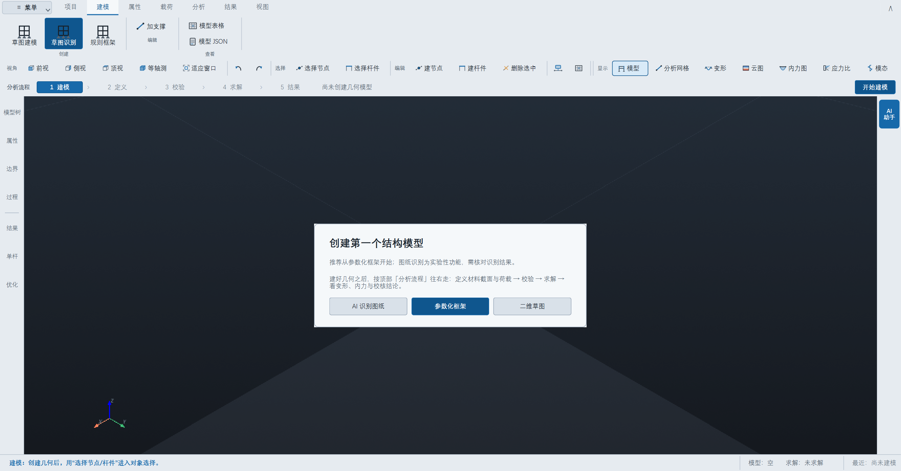

> **打不开怎么办？** 别急着猜。
>
> 跑源码的：双击 `run.bat`，或者在命令行里敲
> `python -m desktop.app --doctor`，它会逐项检查并用中文告诉你**哪一项坏了、
> 下一步做什么**。实在不行，`run_gui.bat` 是网页版，功能一样全。
>
> 用 `FrameLab.exe` 的：双击没反应多半是杀软拦了没签名的程序，
> 在杀软里把整个文件夹放行；提示缺 `VCRUNTIME140.dll` 就装一下微软官方的
> VC++ 运行库（x64）。

### 第 2 步：搭一个架子

屏幕中间那张卡片给了三条路，**新手请点最中间的「参数化框架」**：

| 按钮 | 什么时候用 |
|---|---|
| AI 识别图纸 | 你有一张手画的草图，想让它自己看懂 |
| **参数化框架** | **你只想快速搭一个规规矩矩的架子（推荐从这里开始）** |
| 二维草图 | 你想自己一根一根画 |

首屏推荐参数化框架；AI 识别图纸属于实验性功能，识别后需核对再加载。

点「参数化框架」，弹出「参数化建模」窗口。最上面选**结构形式**
（规整框架 / 坡屋面门式刚架 / 不规则折线刚架），新手选默认的「规整框架」。

下面三行填的是**一串数，不是个数**——这一点最容易填错：

| 填什么 | 举例 | 意思 |
|---|---|---|
| 各跨跨度 (m) | `6 6` | 横向两格，每格 6 米 |
| 各层层高 (m) | `3.6 3.6 3.6` | 三层，每层 3.6 米 |
| 各开间宽度 (m) | 留空 | 只做一榀平面框架；填 `5` 就沿进深再拉一个 5 米的开间 |

也就是说，**写几个数就是几跨、几层**。

填完点「确定」，屏幕中间就出现一个三维的架子。**可以用鼠标拖着转。**

> 窗口下面还有一个勾选项「生成时同时指派属性、柱脚与荷载」。
> **默认不勾**，因为正规流程是几何、属性、荷载分开做（和 Abaqus 一样）。
> 勾上可以一步到位，但下拉框里**只能选已经定义好的材料和截面**——
> 所以想用这个快捷方式，得先按 3.2 节把材料和截面建出来。

### 第 3 步：让它算

看顶上那一条 **`1 建模 → 2 定义 → 3 校验 → 4 求解 → 5 结果`**，
这就是整个流程，从左往右走一遍就行。

点 **「4 求解」**（或者直接按键盘 **F5**）。等一两秒，几步都会打上勾。

### 第 4 步：看结果

求解完，架子会变成彩色的——**颜色就是受力大小**。

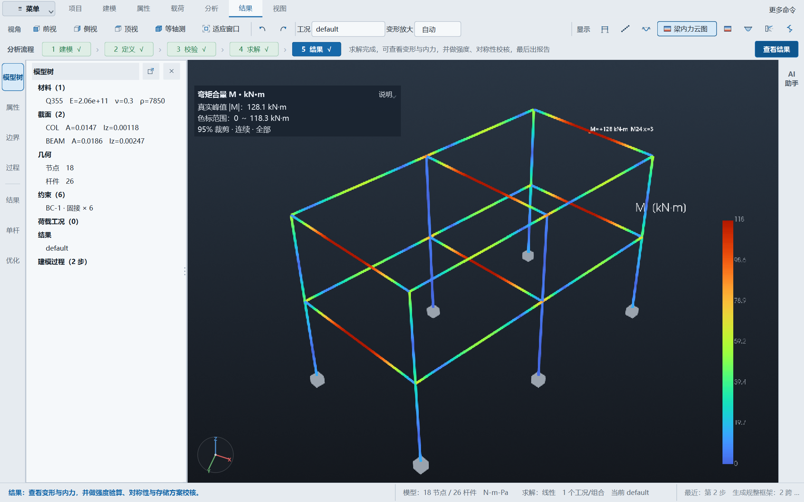

右边那根彩色的条叫**色标**，是颜色和数字的对照表：
**蓝的一头最小，往上经过青、绿、黄、橙，红的一头最大。** 默认是沿杆
**平滑渐变**，一眼看出力沿着杆子怎么变——梁端和跨中红、反弯点附近变蓝。
想把杆子上的一段**对到色标上一个数字区间**，把「分级」从「连续」改成
12 级之类，云图就变成一格一格的色块。

视口左上角的摘要显示当前分量、**真实峰值**、**色标范围**和裁剪/筛选状态。
真实峰值取完整结果的最大绝对值；仅正值或仅负值筛选只影响着色。
95% 裁剪会让超出量程的颜色饱和，因此读取最大值应看真实峰值或极值标注。
点击摘要中的 **说明** 查看正负号定义和适用限制；σ 是梁截面正应力，不包含剪切与扭转剪应力，也不能替代完整承载力验算。

顶上还有几个常用视角：

- **「变形」**：看它被压得歪成什么样（会放大，否则肉眼看不出来）
- **「云图」**：看每根杆受力大小
- **「内力图」**：像结构力学课本那样，在每根杆旁边画出弯矩图、剪力图、
  轴力图——**高度就是数值**，弯矩画在受拉侧。剪力、轴力沿杆不变时，
  云图上整根杆一个颜色看不出大小，这里画出来是矩形，高矮一眼可比
- **「应力比」**：回答"够不够"——每根杆按强度、折算应力、稳定三者里最不利
  的那个着色，蓝（<0.5）→ 绿 → 黄 → 橙（0.9–1.0）→ **红（>1.0，不合格）**；
  灰色表示这根杆的稳定判不了（粗短柱上欧拉公式不适用）。材料要先给许用应力
- 想换看别的力（轴力、剪力、应力），点功能区「结果 → 内力分量」

云图长什么样，在「结果」小窗上有四个开关，**都只改显示、不改算出来的数**：

| 开关 | 干什么 | 什么时候动它 |
|---|---|---|
| 「色系」 | 彩虹 / 蓝—灰—红 / 单蓝 | 要黑白打印，或有人分不清红绿，换成后两种 |
| 「分级」 | 色块分几格 | 看不出梯度就调多，眼花就调少 |
| 「立体」 | 给云图打一层柔和的光 | 想严格照色标读数就关掉，关掉是纯平涂 |
| 「云图量程」 | 95% 裁剪 / 满量程 | 有一两根杆特别大、把其余全压成一个色时，用裁剪 |

---

## 3 完整流程：一个真正能交差的算例

五分钟上手跳过了几步。下面是一次完整的分析该怎么走。

### 3.1 建模（顶上第 1 步）

同第 2 章。建完之后，**左边的「模型树」会列出你建了什么**：材料几种、截面几种、
多少节点、多少杆件、几个支座、几个工况。**这棵树是你的检查清单**——
数字对不上，说明哪一步漏了。

模型树顶部可按名称筛选，例如输入材料或截面名；输入 `节点 65` 或 `杆件 27` 后按 Enter，
可精确选中并将目标移至视口中心，保持当前视角和缩放。单击树中的节点、杆件也可定位；
在视口拾取对象时，树会同步选中对应条目。清除搜索恢复之前的展开状态；无匹配时检查名称或编号。

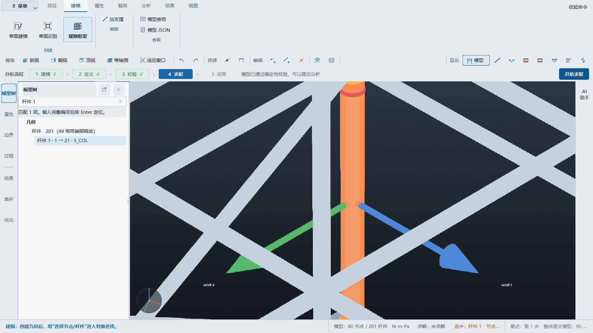

在视口或模型树中选中杆件后，左侧 **属性** 先显示端点、长度、截面和材料。
展开 **高级参数** 可编辑梁方向、刚域偏移、计算长度系数与端部约束；节点属性直接显示坐标和支座约束。
输入完成后按回车或移开焦点提交。非法输入会恢复原值，并在对应字段旁显示原因和修改建议；窄屏会滚动到该提示。
成功修改会使原有分析结果失效，需要重新求解；可用撤销恢复修改。

### 3.2 定义材料和截面（第 2 步）

点功能区 **「属性」** 页。这一页从左到右就是"先有材料、再有截面、然后指派给杆件"。

**材料**（钢、混凝土之类）点「创建材料」。要填的：

| 填什么 | 钢材常用值 | 什么时候必须填 |
|---|---|---|
| 弹性模量 E | 206000000000 Pa（2.06e11） | 总是 |
| 泊松比 ν | 0.3 | 总是 |
| 密度 ρ | 7850 kg/m³ | 想让它算自重时 |
| 屈服应力 | 355000000 Pa（Q355） | 想做稳定校核时 |
| **许用拉应力** | 215000000 Pa | **想做强度验算时** |
| 线膨胀系数 α | 0.000012 | 想算温度应力时 |

> 后面三项在「强度验算与温度（可选）」那一组里，**默认不填也能算位移和内力**，
> 只是做不了强度验算。不填就不填，软件会明确告诉你缺什么，
> **不会偷偷拿个默认值糊弄你**。

**截面**（杆子多粗）点「创建截面」。选一个形状（工字钢、圆管、矩形……），
填几个尺寸，**截面特性它自己算**，还会在下面告诉你这个截面能不能做强度验算。

### 3.3 加约束和荷载（第 3 步）

功能区 **「载荷」** 页。

- **「创建边界条件」**＝指定哪里被固定死。柱脚一般选「固接」（完全不能动）
  或「铰接」（不能移动但能转）。
- **「创建载荷」**＝压多重。梁上的均布荷载最常见，比如 `20 kN/m`。
- **「重力」**＝自重。它按材料密度和截面面积自动算，**前提是你填了密度**。

> **单位提醒**：软件默认用**牛顿和米**。你说"20 kN/m"，要填 `20000`。
> 跟 AI 对话时可以直接说 kN，它会帮你换算并把换算过程写出来。

### 3.4 校验与求解（第 3、4 步）

点 **「3 校验」**。它会检查：有没有杆子悬空、有没有地方没固定、材料截面有没有漏指派。
**有问题会用中文列出来，指明是哪个节点、哪个方向。**

校验过了点 **「4 求解」**（F5）。

后台求解、识别或截面优化执行期间，模型编辑入口会暂时禁用，视角仍可旋转和缩放。
长任务可点击状态栏的 **停止任务**；系统在增量、参数样本或网格阶段之间安全停止，
矩阵分解完成前需要等待。关闭窗口也会先请求停止，任务结束后再退出。
状态栏显示当前分析类型，鼠标停在求解状态上可查看本次求解编号、模型指纹和参数。

> **如果报"结构成为机构"**：意思是这个架子没被固定住，会整体飘走或转动。
> 点「分析 → 模型检查」，它会告诉你**是哪些节点的哪些方向缺约束**。

### 3.5 看结果与校核（第 5 步）

顶部默认展开完整模块功能区，下方保留常驻工具栏与分析流程。
选中 **「结果」** 页即可直接验算或导出报告；点击右上角的 **收起命令** 或双击页签可收起内容，
再点 **更多命令** 展开。视角、选择、编辑与显示模式有直接按钮；窄屏会缩短按钮显示，
当前模式保留文字，鼠标停留半秒可查看完整名称、快捷键与用途。
开始手工建模后，建模设置按钮提供工作平面、捕捉和精确坐标。

模型树、属性与结果等面板的标题栏右侧有独立窗口图标。移出后可并排查看模型与表格，
窗口中的停靠回工作区按钮可返回原位；未提交输入、表格内容和选择状态会保留。
关闭独立窗口后仍可从原侧栏入口重开。截面优化默认使用独立窗口，也可停靠回底部。
拖动面板内侧边缘可调尺寸，双击边缘恢复默认；Tab 可定位侧栏入口，空格可开关。

展开后的结果页提供以下操作：

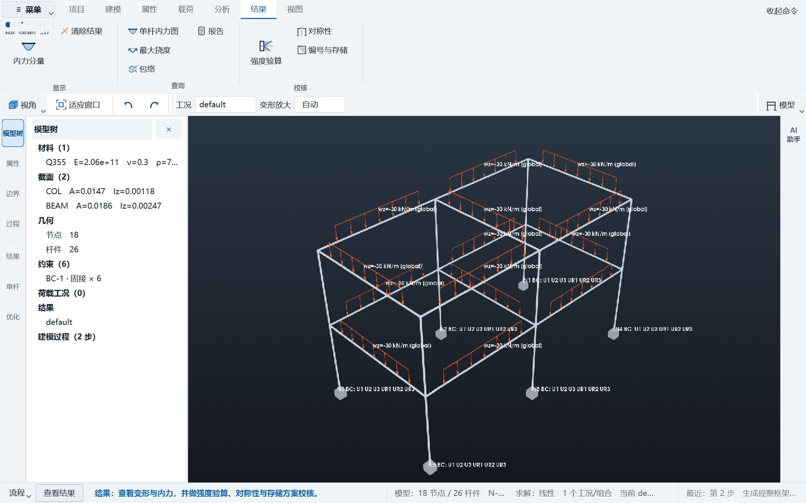

| 按钮 | 回答什么问题 |
|---|---|
| 内力分量 | 换一个力来看（轴力/剪力/弯矩/**应力**） |
| 单杆内力图 | 沿着一根杆子画一条曲线，看峰值在哪 |
| 最大挠度 | 最不利的那根杆弯了多少 |
| 包络 | 多个工况里，每个位置最不利的是哪一个 |
| **强度验算** | **够不够结实** |
| 对称性 | 结构对称吗？顺便自我检查算得对不对 |
| 编号与存储 | 课程里讲的带宽与存储方案对比 |
| 报告 | **一键出 Word 计算书** |

点 **「强度验算」**，下面会出来一张表，**一行一根杆**：

表格上方先显示最大应力比、最大折算比、超限杆件数与无法判定数。
摘要采用紧凑文字排列，点击定位或清单入口可定位杆件或筛选结果。
默认只显示六个关键列，剪切折算比与规范稳定比始终保留；勾选 **全部计算列** 查看长细比、φ、类别和 μ 来源等诊断列。
完整结论和适用限制保存在 **计算说明** 中，云图量程、色系等参数由 **显示设置** 打开。
计算失败或结果失效时，原因和下一步会直接展开显示。

表格的 **结果筛选** 可切换全部、超限或无法判定；排序后仍可点击行定位对应杆件。
支座与荷载标签会自动避让，选中对象的标签优先显示，箭头和约束符号保持可见。

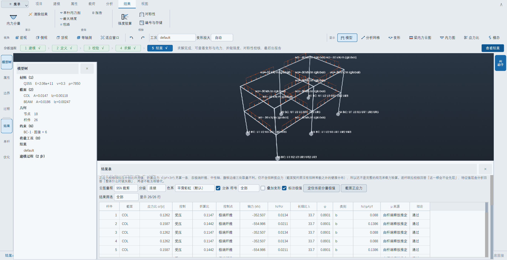

怎么读这张表：

- **应力比 σ/[σ]**：小于 1 就是够结实。0.76 表示用掉了 76% 的余量。
- **折算比**：另一条独立的结论，**也要看**。它把拉压应力和剪应力合起来判，
  而上面那个只看拉压。一根又短又粗的梁，上面那栏可能显示 0.06 看着很安全，
  折算比却是它的两三倍——差别在剪力上，只看第一栏是看不见的。
  **两栏都小于 1 才算过。**
- **控制点**：折算比最不利的位置在哪儿。"中性轴"意味着这根杆是被剪力控制的。
- **N/Pcr 和 N/(φA)/f**：两个稳定指标并排放着，**以右边那个为准**。
  左边是教科书的欧拉公式，它只在细长杆上可信；右边按规范算，粗短杆也算得了。
  两者差很多是正常的——正因为会差很多，才要把它们摆在一起。
- **φ 和类别**：规范用的稳定系数，以及按哪条曲线取的（a/b/c/d）。
  类别不同 φ 能差一半，所以这一栏写出来让你知道这个数的来历。
- **结论那一列有三种，不是两种**：
  - **通过** —— 没问题
  - **超限** —— 真的不够，行会标**红**
  - **判不了** —— 行标**琥珀色**。现在很少见了：只有材料没填屈服应力时
    才会出现，因为那时候连规范的方法也算不了。
    这不是软件坏了，是它在诚实地说"缺参数，这个问题回答不了"。

  > 完整的结论（比如"稳定按 GB 50017 b 类，φ=0.954"）在表格**上方的说明里**，
  > 格子里只放两个字，否则会被截断。

> 这一点值得记住：**这个软件宁可说"我判不了"，也不给你一个来路不明的数。**
> 缺许用应力就拒绝做强度验算，截面缺尺寸就拒绝画应力云图——
> 都会明确告诉你缺什么、去哪儿补。

材料填了许用应力、截面又是按尺寸建的，就能把云图切到 **σ**，
直接看每根杆上的正应力分布：

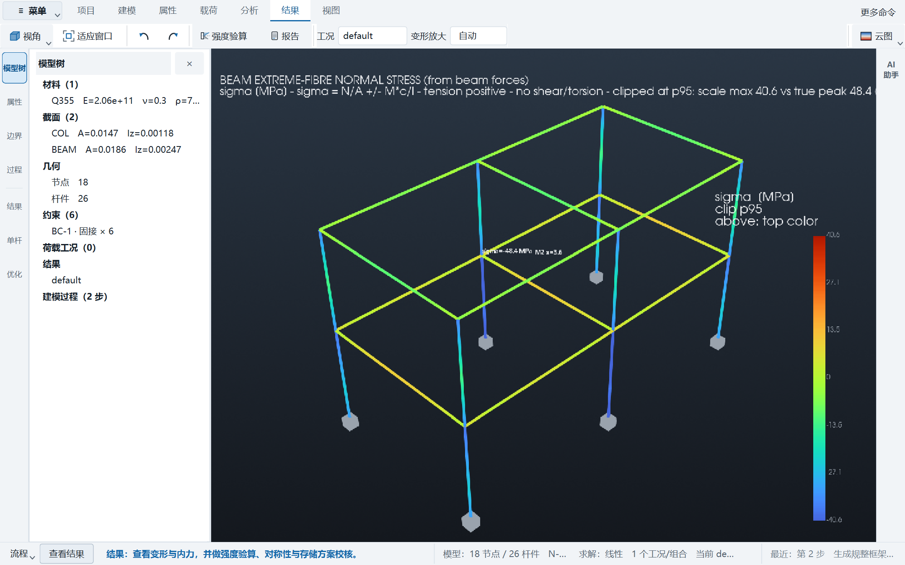

红的地方应力高，蓝的地方低。右边色标上那条刻度就是数值对照。
看到某根杆整根发红，再回头去看强度验算表里它那一行，两处应该对得上。

### 3.6 查看节点实体云图

整体梁模型求解后，在 **分析** 页选择节点并执行 **节点实体**。分析完成后自动进入
**「实体云图」** 主视口，可拖动旋转、滚轮缩放，沿用前视、侧视、顶视、等轴测和适应窗口。

已经计算过的结果，无需再次求解：在 **结果** 页点击 **「打开实体结果」**，选择结果目录中的
**summary.json**、`.vtu` 或 `.npz`。左侧 **「实体结果」** 面板提供网格档位、结果量、色标范围、
变形倍数和显示单元边线；隐藏面板后，再点实体云图入口即可重新展开。

| 设置 | 含义 |
|---|---|
| Mises 应力 / 最大绝对主应力 | 单元应力，单位 MPa，不进行跨单元平均 |
| 位移幅值 | 节点位移向量的长度，单位 mm |
| P99 色标 / 完整范围 | P99 仅截断颜色范围，左上角始终显示全部结果中的真实峰值 |
| 变形倍数 | 0 为原始几何，1 为真实变形；放大显示不会修改原始网格或计算结果 |

勾选 **「点选实体单元」** 后，左键点击表面单元，底部结果表列出该单元的 Mises、
最大绝对主应力，以及十个连接节点的原始坐标和位移分量。节点结果逐项列出，不平均成单元位移。
单元和节点的**序号按当前结果文件排列，从 1 开始**，与整体梁模型编号不同。
点击表中节点行可高亮该实体节点。**「定位实体极值」** 按当前结果量的完整数据定位真实峰值，
应力定位单元、位移定位节点；并列峰值选文件中的第一个。P99 截色和放大变形不会改变查询值。
**「清除实体查询」** 移除高亮和查询表；Esc 退出点选，继续浏览。切换网格档位会清除旧查询。

点击 **「返回整体模型」** 可回到杆件视图。当前分析产生的实体结果绑定整体求解版本，
模型或求解发生变化后失效；从文件打开的结果明确标注为已保存结果，独立于当前整体模型。
单档网格可查看应力分布，正式应力集中系数仍需满足多档收敛条件。

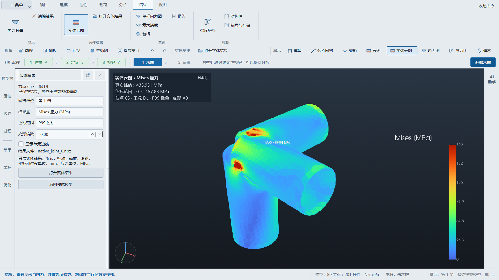

### 3.7 出报告

点 **「报告」**，它会生成 Markdown 和 Word 两份计算书，
包含模型概况、校验、位移、反力、内力极值、自振、稳定、强度验算、对称性、
存储方案对比，还有变形图和内力图。

**报告里每个数字都来自刚才那次计算**，不是另外算的。

导出复用当前分析结果，保留线性、P-Δ 或材料非线性分析类型；报告携带求解编号、
模型指纹与分析参数。模型修改后，旧结果表、探针、内力曲线和云图一并失效，需要重新求解。
正式保存与自动保存都先写完整临时文件再替换；保存失败会说明原因并提示检查权限或另选目录。

### 3.8 两个让画面清爽的小开关

**荷载数值。** 一显示载荷就满屏都是数字，遮住的正是它们要说明的那根杆件。
点功能区「视图 → 荷载数值」可以关掉——**箭头还在**，方向和分布照样看得见，
只是不再标数。再点一次就回来。

**中英文界面。** 点「视图 → 中 / EN」在中英文之间切换。
翻的是功能区、菜单、流程条、结果面板这些**界面骨架**；
对话框正文和报错信息仍然是中文，切过去之后会看到这一点，这里先说清楚。

---

### 3.9 核对图片识别草稿

从建模页打开草图识别独立窗口，选择图片、按需旋转或裁剪，再点击「确认工作平面」。
裁剪范围以应用图片 EXIF 方向后的原图为准；处理失败会保留最近一次有效图片和参数。

使用「预览缩放」放大到 400%，通过滚动条查看局部文字和节点；点击「适应图片」返回完整图。
放大后仍可拖动节点，位置变化会使已有导入确认失效。覆盖标签使用节点、杆件、支座与荷载名称。

低置信度和未知置信度对象需要逐项校核。模型未提供的对象观察记录会显示为未知，
不会自动补成高置信度；确认节点位置不会同时确认支座类型或荷载数值。
修改工作平面或偏移后必须重新确认；存在荷载时切换平面还需重新识别，避免沿用原平面的方向。

识别期间使用主窗口的停止入口可取消任务。已经发出的网络请求需要返回或超时，
其结果会被舍弃，也不会继续发起格式修复。切换图片后旧问题和定位引用会清除。
所有审核和尺度标定完成后，仍需明确确认导入；识别不会自动求解。

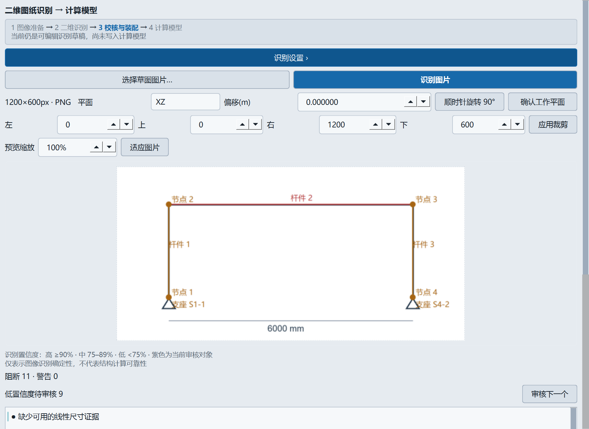

公开工程图的首次在线成绩与修复后离线回放分别记录在
[评测报告](../multimodal_eval/public_cases/REPORT.md)。本组只有 5 张梁图，当前像素位置和
辅助图判读仍有偏差；进入审核后请核对节点、杆件、支座及荷载，未知长度或符号荷载
须人工补充，不能直接用于计算。支座的唯一观察名称现在会沿用到草稿，尺寸观察保留在
尺寸证据中，不再因自动名称或对象归属冲突拒收整份识别结果。

清晰的单条水平填充杆件或唯一闭合矩形可能显示根据像素提出的梁轴候选位置；原始识别
坐标会保留，候选置信度为未知，需要核对端点、支座附着点及中间节点后确认。闭合轮廓
使用初始矩形中轴，内部变形曲线不代替初始梁轴；斜杆、多梁、未闭合或歧义轮廓不校正。
支座覆盖标记会随附着节点候选同步，支座类型仍需独立校核。这一步不补真实长度、材料或荷载数值。

可在「识别设置」中开启「作用点复核」，默认关闭。开启后会额外调用一次视觉接口，
增加耗时和调用成本，只提取集中力/力矩的图片位置候选；不生成荷载大小或真实长度。
黑色实心水平梁也可显示梁轴候选。新增节点、杆件分段及轴候选仍需逐项人工核对，
未知值不作为零，不能直接导入计算。取消会停止后续复核；复核失败时基础草稿保留，
同时说明原因并继续阻断相关问题，不自动再发起修复请求。

初版复核的混合图补出两个作用节点，但力矩位置仍偏向圆弧右侧，需要拖动节点对照圆弧
中心修正；另一图存在支座类型误判，不能据候选数量判断准确率。外荷载或反力含义、
方向、大小和单位须分别核对；旧笼统缺值问题需补充明确输入后重新识别。
原文及失败指标见 [可选复核实测](../multimodal_eval/public_cases/ACTION_REVIEW_REPORT.md)。

现在可选复核还会报告已有支座的可见符号，不因右端位置或静定性默认滚动。
对于附近存在唯一清晰彩色圆弧的力矩，代码拟合圆心并投影到杆件，保留原模型位置
和拟合证据；短弧、多圆、灰度或歧义情况仍需人工定位。新支座类型、节点及分段
都是未审核候选，尺度、荷载大小和单位仍需另行补齐。

核对支座后可以使用「应用支座」或「删除支座」，原符号和修改记录保留。
这只处理明确绑定的支座符号复核问题，其他全局问题继续审核；支座改名后其他问题
仍能定位。未知支座不能仅凭默认掩码确认，应人工选择实际类型并核对。

最新 [圆弧与支座实测](../multimodal_eval/public_cases/MOMENT_SUPPORT_REPORT.md)中三图几何
和支座匹配参考，但一张在线复核因空置信度字段被拒收；兼容修复后的零调用回放
与原在线成绩分别记录。仍有符号荷载占位、缺尺度及数值，不能直接用于工程计算。

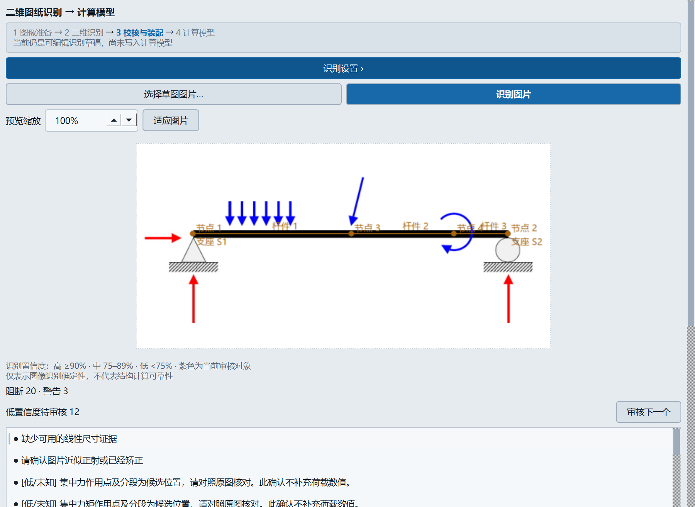

截图没有人工移动节点或输入数值，导入仍阻断；原图 Sjhan81、CC BY-SA 3.0，
署名和来源见下方许可说明。这张截图不代表另一轮在线调用或工程数值验收。

同一对象的低置信度提示现在合并成一行，位置说明也会收纳其已覆盖的界面提示。
详情逐条显示全部说明，核对整组后使用「确认此项」；原记录各自留存人工确认。
阻断和警告总数仍按原始记录计数，荷载缺值、全局疑问及其他对象问题继续单独审核。

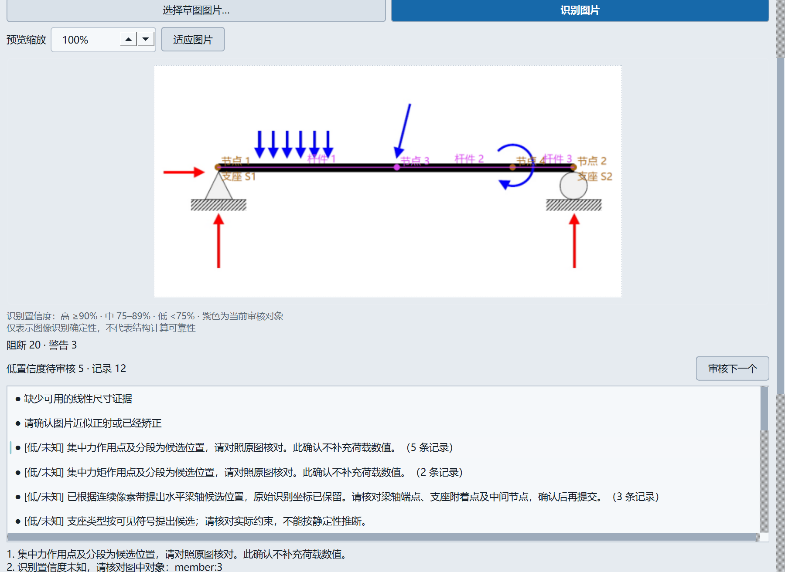

识别出的节点荷载若缺少有效分量，展开「支座与节点荷载」后会显示空白，不能用
默认零值代替。请明确填写 Fx/Fy/Fz（N）及 Mx/My/Mz（N·m），确认分量为零时输入 0，
再点击「应用节点荷载」。切换另一条缺值荷载会重新显示空白；已知有效分量仍保留。
Qt 失焦自动显示的零不算填写，缺值应用被拒绝时请按提示补齐。
人工填写或「删除节点荷载」会保留原条目和观察，只处理精确绑定的该条缺值问题；
同节点其他荷载、全局及历史笼统问题继续核对。

修改识别出的名称时，展开「工况与荷载名称」，先选择原工况，再填写新工况名并点击
「修改工况名称」。荷载列表同时显示原名称、类型和作用节点或杆件；选中原条目，
填写新名称后点击「修改荷载名称」。节点、整段均布、跨间荷载和支座位移都可逐项核对。
这里修改已有条目，不会留下旧名称的重复荷载；支座与节点荷载面板中的可编辑名称框
用于新增或更新同名条目，不能代替已有荷载改名。
新名称不能为空、不能与同一工况同类型条目重名，也不能含冒号或控制字符。
切换对象会清除未提交的新名称。改名同步当前覆盖和审核引用，原名称保留在编辑记录；
原观察、向量、单位、作用点、置信度和审核状态保留，导入确认失效。
改名不会解除缺值、尺度或位置问题，请继续逐项核对后重新确认导入。

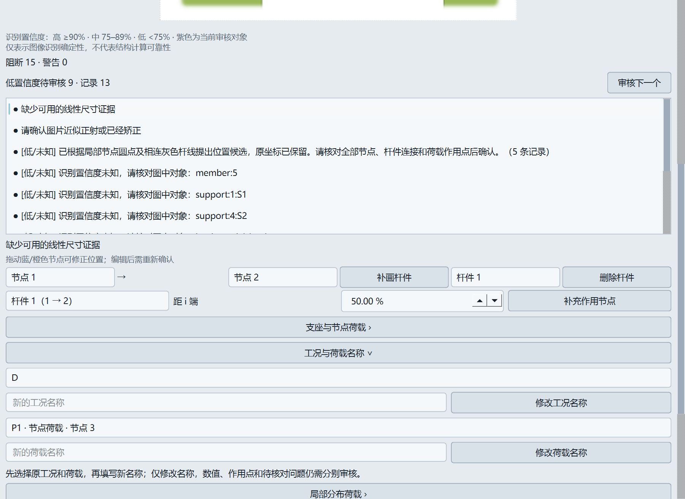

截图为 125% 原生窗口对冻结响应的人工编辑回放：手动将工况 F 改为 D、荷载 F 改为 P1，
没有移动节点或填写工程数值，导入仍阻断；不计入自动识别或在线准确率。
125% / 150% 各核对两图，数值及作用节点、问题状态不变，新增视觉调用为零。
原图 Jacob Moore and Contributors / Mechanics Map，CC BY-SA 4.0，图像沿用原许可；
来源见下文真实数值首测记录。

新增独立评测样本须在视觉调用前按 `multimodal_eval/REFERENCE_TOPOLOGY.md` 核对拓扑参考，
逐对标注共享端点、T/X 交汇与连接决定；缺项、重复或错位会拒绝新调用。
新响应绑定调用前参考哈希，事后修改标注不能重新冻结评分；应保留旧失败并建立新轮次。
旧样本仍可读取及回放，报告明确列出旧参考限制，不补旧标注或重写历史成绩。
两张新的许可图已用完整参考做单次首测：塔架输出截断，墙上桁架因重复杆件被拒绝，
两图均未形成可用草稿，失败原文与参考保留，详见 [完整参考首测](../multimodal_eval/public_cases/HOLDOUT_REPORT.md)。
遇到这类错误请先按提示检查输出及连接，不把局部读到的荷载标签当成完整可用模型；
英制单位、墙面支座方向和工作平面还需逐项核对。本轮不自动重试或替用户删除重复杆件。

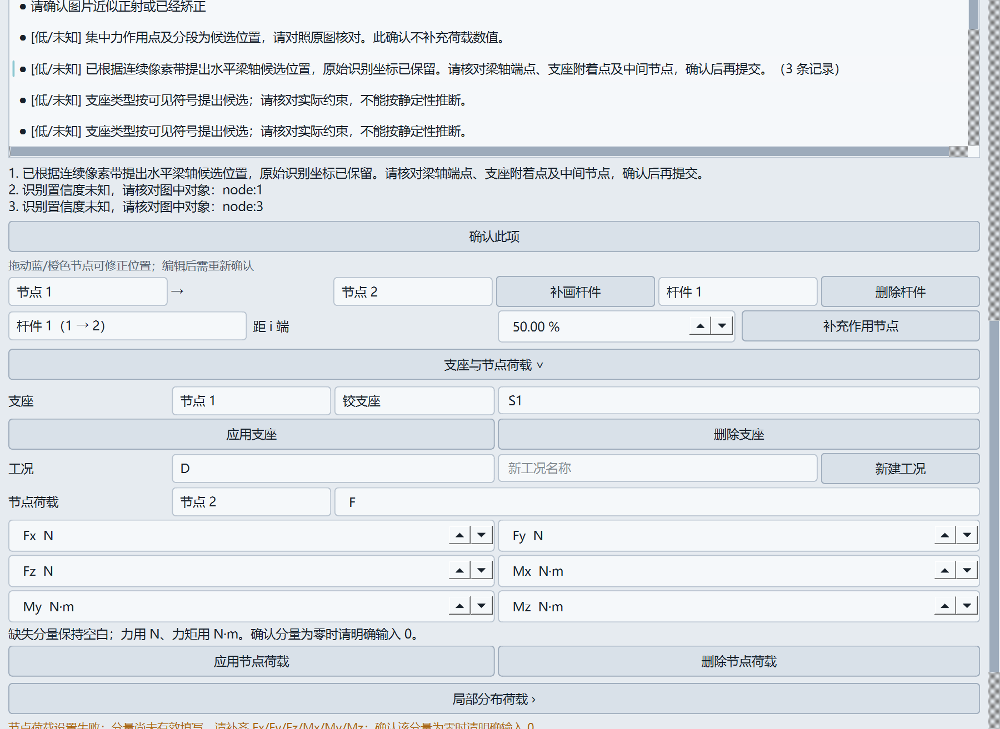

参考实际长度现为空白，换图或换参考杆件时清除旧值。请先核对原图标注与所选杆件，
再明确填写大于零的米值；不能直接使用默认 1 m。Qt 清空后恢复的旧数字也不算填写。
「图中尺寸（待核对）」只读区域显示识别到的尺寸原文及单位，可滚动查看全部观察，
不会自动填入实际长度或确认比例尺。跨度、投影距离和角度应与原图逐项核对，
不能把水平尺寸直接作为斜杆长度。新许可图的自动节点位置仍有偏差，先核对覆盖位置。

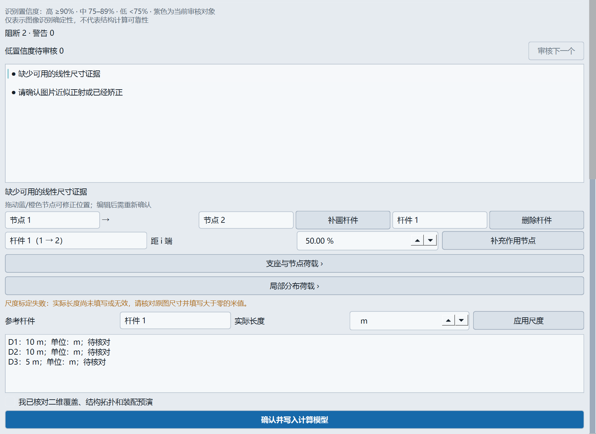

截图为 125% 原生窗口对冻结响应的离线回放，没有填写长度或移动节点，导入仍阻断。
原图 Jacob Moore and Contributors / Mechanics Map，CC BY-SA 4.0；来源、许可与首测限制
见 `multimodal_eval/public_cases/NUMERIC_REPORT.md` 及该轮元数据，截图中图像沿用原许可。

对于具有清晰节点圆点及灰色杆线的多杆图，程序可提出节点位置候选；每个节点和所有已有
杆件都须有唯一像素证据，缺失或歧义时保留原识别。候选同步支座和荷载的图片位置，
不更改荷载向量、工况、名称或实际尺度。原坐标和证据保留，已审核对象与人工数据受保护。
位置说明会要求核对全部节点、连接及荷载作用点；候选仍未审核，不能直接导入计算模型。

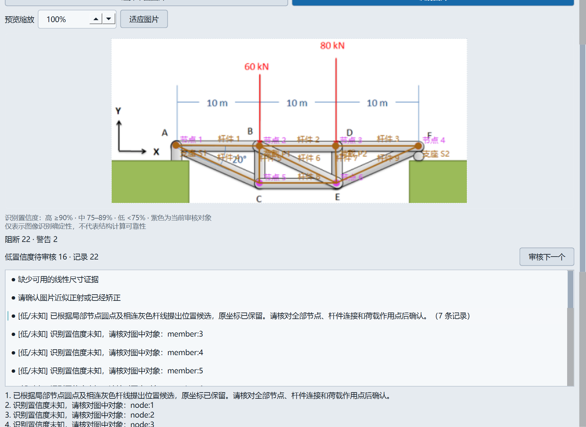

截图为 125% 原生窗口零调用回放，没有人工移动节点或填写工程值，导入仍阻断。
原图 Jacob Moore and Contributors / Mechanics Map，CC BY-SA 4.0，图像沿用原许可。
见 `multimodal_eval/public_cases/JOINT_NODES_REPORT.md`；本轮离线改善只针对已知开发样本，
工况标识差异、尺度未知及交叉参考缺口保持，不能当作新的在线准确率。


两图均为 125% 原生窗口离线回放，没有输入数值或人工移点。混合图原图 Sjhan81、
CC BY-SA 3.0；集中荷载图原图 Tkn20、公有领域，许可来源见下方说明及各图元数据。
[本轮审核验证](../multimodal_eval/public_cases/REVIEW_EDIT_REPORT.md)新增调用为零，
原问题、无数值占位和历史成绩不删改，完整多模态验收仍未通过。


截图原图来自 Sjhan81，CC BY-SA 3.0，来源见下方图片许可说明；新增节点没有人工
移动，也没有输入数值荷载，导入仍阻断。截图为界面回放验证，不是另一轮在线成绩。

不能绑定到数值荷载的符号会保留为待核实观察。只有明确判定该组观察无需作为外荷载输入时，
才使用「忽略符号」；原始符号和人工处理记录仍保留，其他缺值或单位问题仍需补充。
若符号观察与已有全局缺值问题合并，不提供忽略入口，避免同时解除原数值问题。
若符号表示实际外荷载，先补齐数值和单位并重新识别，不能用忽略操作代替输入。
空响应或输出截断会说明原因并提示检查视觉模型、裁剪图片或简化输入，不继续发起格式修复。
最新在线轮次及当前代码回放见 [分轮对照](../multimodal_eval/public_cases/ROUND_REPORT.md)，
在线 5/5 进入审核仍不等于几何全对，尚未通过完整验收阈值。

后续轮次及独立混合荷载图见 [最新实测](../multimodal_eval/public_cases/OUTLINE_REPORT.md)。
此前原 5 张开发图的几何达到原阈值，但独立试点首轮仍漏掉集中作用点；符号占位没有可用数值，
仍需补齐单位、荷载和尺度。进入审核后请逐项核对，不能据小样本开发成绩直接计算。

漏掉集中力或力矩作用点时，先拖动原节点核对梁轴，然后选择待分段杆件，按显示的
i → j 节点方向填写距 i 端的百分比，点击「补充作用节点」。这只表示图片中相对位置，
不是实际长度；新节点会自动选入节点荷载面板，展开支座与节点荷载后再填写力或力矩。
原支座、端点荷载与尺度保持，导入确认失效，需要重新审核。已有杆件荷载、尺寸或人工
交点引用时，先核对并处理引用；含端部释放或其他属性的杆件不能直接自动分段。
分段后的两根共线杆件会记录共享端点连接，使用已有节点，不要求重复确认或创建节点。
该自动记录不阻止继续补点或删除无其他引用的杆件；共线重叠仍须处理。

集中力矩识别值按 N·m/kN·m 转入 Mx/My/Mz，不能按 Fx/Fy/Fz 使用。局部分布荷载
只有起止长度及单位明确时才转换为杆件内范围；范围未知或单位不兼容继续阻断，
不会自动扩大成整跨。仍须核对旋向、作用位置、范围、数值和单位后才能计算。
此前单阶段全图与裁剪的混合图仍自动漏点，详见 [作用点实测](../multimodal_eval/public_cases/LOAD_POINTS_REPORT.md)。

需要人工补充或修正部分分布荷载时，先确认工作平面、实际尺度，并在支座与节点荷载中
创建工况。展开「局部分布荷载」，选择工况、杆件和荷载名称；按显示的 i → j 方向
填写距 i 端的 a、b（米）。选择「局部均布」或「局部梯形」，按全局 X/Y/Z 方向填写
强度（N/m），梯形还需填写终点强度。未知值显示为空白，确认分量为零时也要明确输入 0。
点击「应用局部荷载」后，图片中的平行括线标出实际作用区段；越界或未确认尺度不能应用。
拖动端点或重设尺度后会重新校核范围，越界时清除旧覆盖并阻止导入，需修正范围。

选择已存在的名称即可修改；点击「删除局部荷载」只删除当前工况的该条局部荷载，
原观察仍保留在审核记录。修正仅解除明确绑定到该条荷载的缺值问题，其他荷载、杆件级
或全局问题继续审核。旧响应若缺少精确绑定，不能用这次编辑直接清除笼统问题，
需核对原图并补充明确数值后重新识别；手工输入不代表自动识别已经通过。

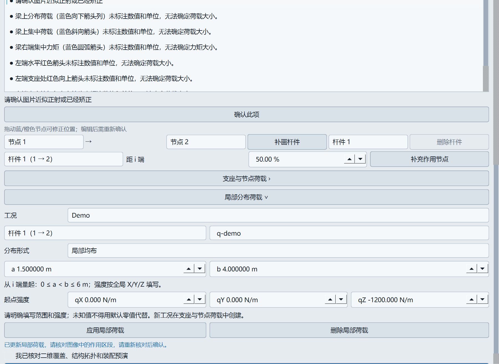

截图中的 6 m、1.5–4 m 和 −1200 N/m 均为人工演示输入，并非原工程图的数值；
其余缺值问题仍阻止导入。原图许可与署名沿用下方图片许可说明。

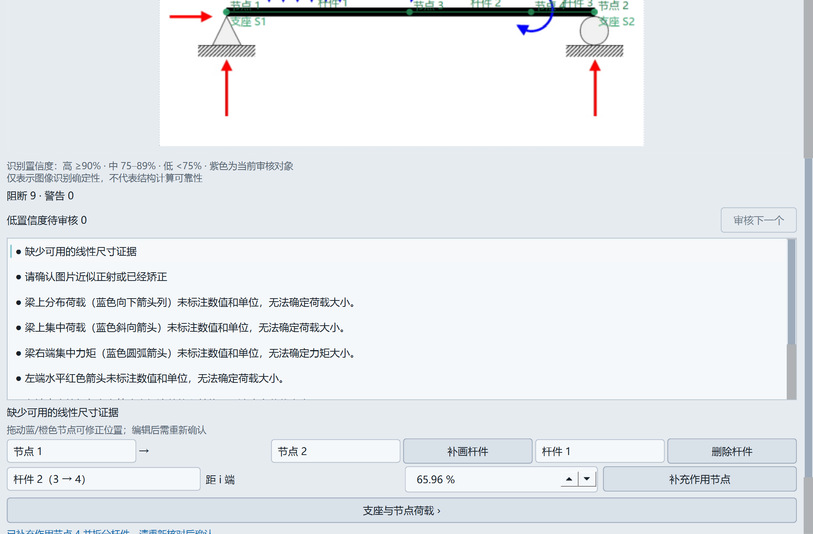

图中原工程图来自 Sjhan81，许可 CC BY-SA 3.0；署名及来源见
[图片许可说明](../multimodal_eval/public_cases/validation_01/README.md)。截图中节点经人工修正，
不表示视觉模型已识别正确；图片许可不因软件代码使用 MIT 而改变。

## 4 用中文跟它说话（AI 助手）

AI 助手默认是收起的。点视口**右缘那个 `AI` 浮标**把它调出来，
再点一次（或关掉面板）收回去。**它能做什么**：

- 听懂"两跨三层，跨度 6 米，层高 3.6 米"这种话，自己把架子搭出来
- 你没说清楚的地方**会反问你**（比如没说截面多大）
- 算完之后解释结果、告诉你哪里最危险

**它不做什么**：

- **它不做任何计算。** 所有数字都来自求解器，它只负责把你的话变成操作、
  再把结果讲给你听。这是故意设计成这样的——让它算数，它算错了也不会告诉你。

> **要联网和密钥**。没有密钥时它处于"离线演示模式"：对话按预设走，
> 但**工具调用和求解都是真的在执行**。密钥写在项目根目录的 `deepseek.key` 里，
> 一行就够。**别把密钥贴进聊天框或者终端里**——每贴一次就泄露一次。

---

## 5 出问题了怎么办

**先看这张表，不要瞎点。**

| 现象 | 多半是什么原因 | 怎么办 |
|---|---|---|
| 双击 `.bat` 一闪就没了 | 依赖没装好 / 显卡驱动 | 命令行跑 `python -m desktop.app --doctor`，看哪一项是 `!!` |
| 打开是黑屏或者一开就崩 | 没有可用的 OpenGL（远程桌面、虚拟机常见） | 用网页版 `run_gui.bat`，功能一样全 |
| 求解报"结构成为机构" | 约束不够，架子会飘 | 「分析 → 模型检查」，它会指出是哪些节点哪些方向 |
| 点「强度验算」被拒绝 | 材料没填许用应力 | 「属性 → 创建材料」勾上"给出许用应力" |
| 点「应力云图」被拒绝 | 截面没有极端纤维距离 | 用「创建截面」按尺寸建的截面才有；直接填 A/I/J 的没有 |
| 云图一片同色 | 有个别位置数值特别大，把别处压扁了 | 结果面板把「云图量程」从"满量程"切到"95% 裁剪" |
| 结果看着不对劲 | 先用对称性自查 | 点「对称性」，结构对称的话它会验证结果是不是也对称 |
| 改了模型，结果没变 | 结果还是上一次的 | 重新点「4 求解」。改模型会自动清掉旧结果 |

> **一条总原则**：这个软件里，**大多数"不对"都会明确告诉你原因**。
> 看到红字先读完再动手，它写的是"哪里错了 + 下一步做什么"，不是错误代码。

---

## 6 不用界面，用命令行

想批量算、或者接到别的流程里：

```bat
cd /d <项目文件夹>
.venv\Scripts\activate.bat
set PYTHONPATH=src;evalset;abaqus_bench

pytest                                   :: 跑全部自检，确认环境是好的
python examples\run_json.py examples\portal_frame_cases.json   :: 按 JSON 算一个例子
python examples\agent_demo.py            :: 看一遍 AI 的完整流程（不用联网）
```

五个入口脚本：

| 脚本 | 干什么 | 要联网吗 |
|---|---|---|
| `run.bat` | 建环境、跑测试、跑离线演示 | 不用 |
| `run_desktop.bat` | **桌面端（推荐）** | 首次装依赖要 |
| `run_gui.bat` | 网页端，功能等价 | 不用 |
| `run_live.bat` | 用真实大模型跑 5 道题 | 要 |
| `run_eval.bat` | 跑 37 题评测集，出成绩单 | 要 |

---

## 7 一页速查

**最常用的五个动作：**

1. 建架子 → 中间卡片「参数化框架」
2. 填材料截面 → 功能区「属性」
3. 加固定和重量 → 功能区「载荷」
4. 算 → 按 **F5**
5. 看 → 功能区「结果」

**最常用的五个快捷键：**

| 键 | 作用 |
|---|---|
| `F5` | 求解 |
| `1` / `2` / `3` / `4` | 前视 / 侧视 / 顶视 / 等轴测 |
| `F` | 把模型缩放到刚好充满窗口 |
| `Ctrl+Z` | 撤销上一步（结果会一起清掉） |
| `Ctrl+G` | 显示 / 隐藏右边的 AI 对话栏 |

**记住三句话就够：**

1. 使用顶部分析流程和下一步按钮：建模 → 定义 → 校验 → 求解 → 结果。
2. 左边的模型树是你的检查清单，数字对不上就是漏了东西。
3. 软件说"判不了"的时候，它是在诚实，不是坏了。
