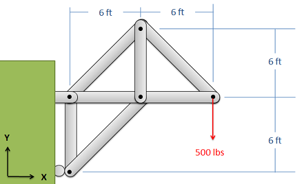
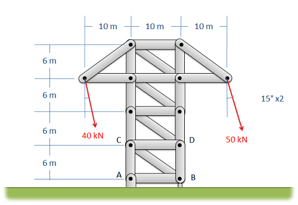

# 新图样完整拓扑参考首测 — 2026-10-10

两张本项目此前未用于开发的工程图在调用前固定原图、完整参考、模型参数与当前八份处理源码。
每图仅基础识别一次，DeepSeek / deepseek-flash，max_repairs=0，不启用额外作用点复核。
**两图均失败，完整验收未通过。** 原响应保留，没有重试、补全截断 JSON、删除重复杆件或改参考。

## 原图与许可

作者为 Jacob Moore and Contributors / Mechanics Map。两页明确采用 CC BY-SA 4.0，图未另列许可
例外；原 PNG 按下载字节保存，不裁剪、旋转或改绘。作者、原图地址、页修改时间、许可核对时间
记录于 [metadata](holdout_01/metadata)，图像及包含图像的衍生物沿用原许可，代码 MIT 不改变图像许可。

| 图样 | 来源及许可 | 调用前参考 |
| --- | --- | --- |
| wall_truss | [Method of Joints，例 2](https://eng.libretexts.org/Bookshelves/Mechanical_Engineering/Mechanics_Map_(Moore_2nd_Edition)/05:_Engineering_Structures/5.04:_Method_of_Joints)，[CC BY-SA 4.0](https://creativecommons.org/licenses/by-sa/4.0/) | 5 节点、7 杆件、14 对共享接头，包含水平共线接头 |
| tower_truss | [Method of Sections，例 2](https://eng.libretexts.org/Bookshelves/Mechanical_Engineering/Mechanics_Map_(Moore_2nd_Edition)/05:_Engineering_Structures/5.05:_Method_of_Sections)，[CC BY-SA 4.0](https://creativecommons.org/licenses/by-sa/4.0/) | 12 节点、21 杆件、59 对共享接头，包含竖直及水平共线接头 |

## 调用前固定与数值来源

参考由编码助手目视原图独立完成，未读取预测或使用运行时检测生成答案，未经外部专家复核。
verified 表示内部完成；完整性检查不证明所有人工连接、支座和荷载判断正确。
参考逐对覆盖接头，校验通过后才创建视觉客户端；响应绑定调用前参考哈希。
[round_info](holdout_01/round_info.json) 绑定原图、参考、元数据、提示、参数、源码指纹和冻结时间，
[pipeline_snapshot](holdout_01/pipeline_snapshot.json) 保存当时八份核心源码。

新图原字节及解码 RGB 像素均未与当时项目 36 份历史图片文件重复，历史清单及哈希在 round_info。
这是本项目的留出试点，不保证模型训练数据未见过这些公开图片。两图同作者同画风，不代表
真实手绘、手机照片、多提供商或广泛泛化。后续若针对它们修算法，两图转为开发样本。

墙图外力标为 500 lbs，结合来源的外力题意按 lbf 核对；参考 N 值由 500 × 4.4482216152605
计算，向下 Fy = −2224.11080763025 N。精确系数见 [NIST SP 811 脚注 23](https://www.nist.gov/pml/special-publication-811/nist-guide-si-footnotes)。
墙面滚动支座释放平面 Y，不能套用水平地面滚动支座的 X 释放。

塔架两端外力为 40/50 kN，均向右下，与竖直各夹 15°。参考用 math.sin/cos 计算
Fx=F·sin(15°)、Fy=−F·cos(15°)，分别为 (10352.76180410083, −38637.033051562736) N 和
(12940.952255126036, −48296.29131445342) N；计算输入、公式和输出在 round_info。
没有求解结构响应。原图未声明按比例，scale 真值 unknown；尺寸保留为独立原图观察。
工况 D、P1/P2 为调用前约定，图中未命名；命名差异仍按原严格评分，不事后调分。

## 首响应与严格评分

| 图样 | 次数 | 耗时 | 结束原因 | 结果 |
| --- | ---: | ---: | --- | --- |
| tower_truss | 1 | 15.218 s | length，输出 4000 token | JSON 截断，拒绝进入草稿 |
| wall_truss | 1 | 5.594 s | stop，输出 1600 token | 杆件 5/6 的端点互为反向重复，v2 校验拒绝 |

两次总耗时 20.812 s，中位 10.406 s。SDK 重试关闭，未增加修复或复核调用，失败输入仍在分母。
[report](holdout_01/report.json) 中两图格式成功为 0/2，节点/杆件/支座/荷载 F1、交点及数值单位
评分均为 0，尺度为 null。参考契约检查覆盖 2 图、legacy_cases 为空；17 个节点、28 根杆件、
73 对接头全部保留。这里的 0 包含整份无效输出被拒绝，不能解释成每个局部符号都没有被读出。

墙图原文还读到了 500 lbs，但仅有滚动支座条目，整体校验失败且 lbs 不在现有单位转换范围，
不能将读到标签等同正确可用荷载。
塔架原文保存至被截断处，不对部分对象单独评分或截取成功结果。

原图、标注、响应、manifest 与历史成绩保留；复跑评测不会发起视觉调用，再次 recognize 只报告
首响应已存在或过期。新增回归检查完整参考、调用前绑定、图片排重、单位/角度来源、失败分母
与禁止自动重试。原 numeric_01 首测及所有历史报告保持原字节。

下一轮优先缩减重复输出并验证长度上限，明确重复杆件的修复/人工审核路径，再处理英制单位、
工作平面方向和墙面支座识别；改算法后使用新的留出图重新验证，不把这两图再次称为独立样本。

2026-10-10 复核更正：原元数据实际确认 XZ，首调用上下文也是 XZ，而参考力向量及墙面
滚动方向按 XY 标注。旧说明误写“已确认 XY”，现在纠正；不能据此将首响应的 −Z 判为
违背用户平面。两份参考存在工程语义与输入平面不一致，原 0/2 格式失败证据仍成立，
原标注、元数据、响应和 report 不改；荷载/支座分数不能用于轴向准确率结论。
后续 [开发复测](COMPACT_REPORT.md) 在新轮次调用前统一 XY，单独记录变更。
